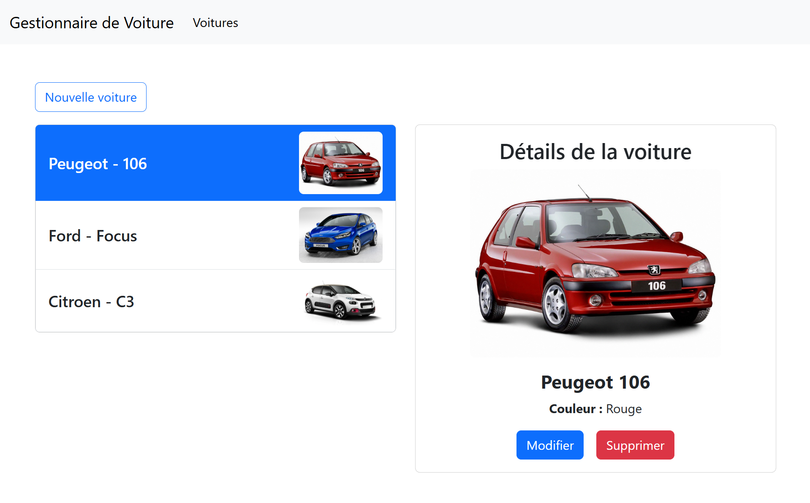

# Gestionnaire Voiture

Un gestionnaire de voiture simple en Angular, stylisée avec Bootstrap. A partir d'une liste de voiture, vous avez la possibilité de modifier un voiture, d'en supprimer ou ajouter.
Ce projet a été généré en utilisant [Angular CLI](https://github.com/angular/angular-cli) version 19.1.6.



## Fonctionnalités

- **Nouvelle voiture**
- **Liste de voiture**
- **Modifier**
- **Supprimer**

## Technologies utilisées

- **Angular** : Structure du projet
  - **HTML** : Structure de la page
  - **CSS** : Design et mise en forme
  - **TypeScript** : Logique et lien des pages

## Utilisation

Pour exécuter le projet, télécharger le zip ou cloner localement le projet. Ouvrer le projet dans une IDE et exécuter le commande :

```bash
npm install
(commande Node.js)
```

Pour démarrer le serveur de développement local, exécutez :

```bash
ng serve
```

Une fois le serveur en cours d'exécution, ouvrez votre navigateur et accédez à `http://localhost:4200/`. L'application se rechargera automatiquement.
